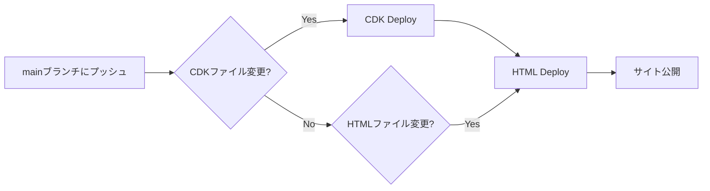

## 1. プロジェクト概要
本プロジェクトは、**CloudFront + S3** による静的Webサイトホスティング構成を **AWS CDK** でコード化し、**GitHub Actions** を利用してCI/CDパイプラインを構築したものです。サンプルとしてAI生成のHTMLゲーム（スネークゲーム）を配置していますが、`html` 配下に任意の静的コンテンツを置くことで、どのような静的Webサイトにも利用可能です。

[](https://opensource.org/licenses/MIT)

> 💡 **ポイント**: CDKをローカルにインストールしなくても、GitHub Actionsのみでデプロイが可能です。

### 1.1 特徴

- 🔒 **セキュリティファースト**: CDK Nag、OAC、パブリックアクセスブロック
- 🌍 **クロスリージョン対応**: スタック間参照問題を解決したSSM+カスタムリソース方式
- 🚀 **完全自動化**: GitHub ActionsでCDKデプロイからコンテンツ更新まで
- 💰 **コスト最適化**: 30日TTLキャッシュ、自動ログライフサイクル
- 🛠️ **開発効率**: TypeScript完全採用、ESLint/Prettier統合

### 1.2 技術スタック
- **AWS CDK**（TypeScript）
- **AWS S3**（静的Webホスティング）
- **AWS CloudFront**（CDN配信）
- **GitHub Actions**（CI/CD）
- **HTML / CSS / JavaScript**（コンテンツ部分）

### 1.3 アーキテクチャ構成図


詳細な設計については[CDKアーキテクチャ設計書](doc/cdk-architecture-design.md)を参照してください。

---

## 2. デプロイ方法

### 2.1 🚀 クイックスタート

1. リポジトリをフォークまたはクローン
2. AWSでIAMロールとOIDCプロバイダーを作成
3. `cdk/config/shared.ts`でドメイン名を変更
4. GitHub Secretsに`CDK_DEPLOY_ROLE`と`AWS_ACCOUNT_ID`を設定
5. `main`ブランチにプッシュで自動デプロイ開始

> 📄 詳細な手順は下記を参照してください。

### 2.2 IAMロール作成（GitHub Actions用Assumeロール）
GitHub ActionsがAssumeするIAMロールを作成します。信頼ポリシーの例：
```json
{
  "Version": "2012-10-17",
  "Statement": [
    {
      "Effect": "Allow",
      "Principal": {
        "Federated": "arn:aws:iam::<ACCOUNT_ID>:oidc-provider/token.actions.githubusercontent.com"
      },
      "Action": "sts:AssumeRoleWithWebIdentity",
      "Condition": {
        "StringLike": {
          "token.actions.githubusercontent.com:sub": "repo:<YOUR_ORG>/<REPO_NAME>:ref:refs/heads/main"
        }
      }
    }
  ]
}
```

### 2.3 GitHub Actions用 OpenID Connectプロバイダ登録
1. IAMコンソールにアクセス  
2. 左メニュー > **IDプロバイダー (Identity providers)** をクリック  
3. 「プロバイダーを追加」をクリック  
4. 以下を設定：

| 項目 | 入力内容 |
|---|---|
| プロバイダーの種類 | OpenID Connect |
| プロバイダーのURL | `https://token.actions.githubusercontent.com` |
| 対象者（audience） | `sts.amazonaws.com` |

5. 「次へ」→「確認して作成」

### 2.4 設定ファイル編集
`cdk/config/shared.ts`でドメイン名を変更してください。

```typescript
export const CONSTANTS = {
  PROJECT_NAME: 'YourProject',
  ROOT_DOMAIN: 'your-domain.com',
  SUB_DOMAIN: 'www',
  // ...
};
```

### 2.5 GitHub Secrets 登録
以下をGitHubリポジトリのSecretsに登録します。

| Secret名 | 説明 | 例 |
|------------|------|----| 
| `CDK_DEPLOY_ROLE` | CDKデプロイ用IAMロール名 | `my-cdk-deploy-role` |
| `AWS_ACCOUNT_ID` | AWSアカウントID | `123456789012` |

### 2.6 デプロイの流れ



- **CDKデプロイパイプライン** (`cdk-deploy.yml`): インフラ構築、セキュリティチェック、CDKデプロイ
- **HTMLデプロイパイプライン** (`html-deploy.yml`): コンテンツアップロード、CloudFrontキャッシュ無効化

> 🚀 **自動化**: `main`ブランチへのプッシュで全て自動実行されます。

---

## 3. 📊 コスト見積もり

| アクセス数/月 | CloudFront | S3 | Route53 | 合計 |
|-------------|------------|----|---------|---------| 
| ~10K | $0.50 | $0.10 | $0.50 | **~$1.10** |
| ~100K | $2.00 | $0.50 | $0.50 | **~$3.00** |
| ~1M | $15.00 | $2.00 | $0.50 | **~$17.50** |
> 💡 **ポイント**: 初期コストはレンタルサーバと比較しても低く、アクセス数が増えてもスケーラブルな構成です。

## 4. CDK実装の特徴

### 4.1 セキュリティ対策
- **CDK Nag**: セキュリティベストプラクティスの自動チェック
- **OAC (Origin Access Control)**: CloudFront経由のみS3アクセス許可
- **パブリックアクセスブロック**: S3バケットの完全プライベート化
- **HTTPS強制**: セキュリティヘッダーポリシー適用
- **最小権限IAM**: AWS管理ポリシー回避、カスタムインラインポリシー採用

### 4.2 クロスリージョン・スタック間参照
- **SSMパラメータ + カスタムリソース**: us-east-1の証明書をap-northeast-1から参照
- **スタック削除問題の解決**: 従来のExport/Import方式の課題を回避
- **config/shared.ts**: cdk.jsonではなく独自設定ファイルで一元管理

### 4.3 運用・保守性
- **自動ログ管理**: CloudFrontアクセスログの自動ライフサイクル（90日保持）
- **キャッシュ最適化**: 30日TTL設定によるコスト削減とパフォーマンス向上
- **設定一元管理**: 共通設定ファイルによる型安全な設定値管理
- **GitHub OIDC**: 長期認証情報を使用しないセキュアなCI/CD

### 4.4 コード品質・開発効率
- **TypeScript完全採用**: 型安全性とIDE支援による開発効率向上
- **Linter統合**: ESLint + Prettier によるコード品質管理
- **関数型アプローチ**: 各機能を独立した関数として実装
- **再利用可能性**: 共通ユーティリティの部品化
- **設定一元管理**: config/shared.tsでプロジェクト全体の定数を型安全に管理

---

## 5. 🔗 関連リンク

- 📚 [AWS CDKドキュメント](https://docs.aws.amazon.com/cdk/)
- 🔒 [CDK Nag](https://github.com/cdklabs/cdk-nag)

## 6. 💬 フィードバック

バグ報告や機能提案はGitHub Issuesでお気軽にどうぞ！

## 7. 🔮 将来の展望

将来的には **API Gateway + Lambda + DynamoDB** でスコア登録機能を実装したいと考えています。その際、不正スコア登録防止のために、**二段階トークン方式**（CloudFront Functionsによる前段検証）の導入を検討しています。

## 8. 📜 ライセンス

[MIT License](LICENSE) - 自由に使用、改変、配布可能です。