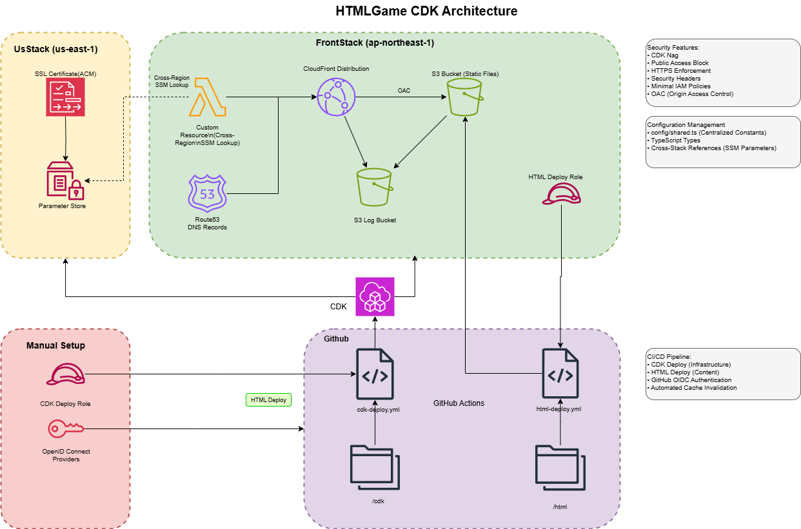

# CDK アーキテクチャ設計書

最終更新: 2025-01-27

## 概要

本プロジェクトは、AWS CDKを使用してHTMLゲーム配信用の静的サイトインフラを構築するものです。スタック間参照問題の解決、セキュリティベストプラクティスの実装、コスト最適化を重視した設計となっています。

## アーキテクチャ構成

### 構成図


### スタック構成
- **UsStack** (us-east-1): CloudFront用SSL証明書の作成・管理
- **FrontStack** (ap-northeast-1): 静的サイト配信インフラ
- **Manual Setup**: CDKデプロイ用IAMロールの手動作成

### 主要コンポーネント
- **CloudFront Distribution**: CDN配信、HTTPS強制、セキュリティヘッダー
- **S3 Bucket**: 静的ファイルホスティング、OACで保護
- **ACM Certificate**: us-east-1で作成、CloudFront用SSL証明書
- **Parameter Store**: クロスリージョン参照用証明書ARN保存
- **Lambda**: カスタムリソースでクロスリージョンSSM参照
- **Route53**: DNSレコード管理
- **IAM Roles**: GitHub Actions用デプロイロール（手動作成とCDK作成）

## スタック間参照問題の解決

### 問題の背景
- CloudFront用SSL証明書はus-east-1リージョンに作成が必要
- 静的サイトインフラはap-northeast-1リージョンに配置
- 従来のスタック間参照では削除時に依存関係の問題が発生

### 採用した解決策: SSMパラメータ + カスタムリソース方式

#### 1. UsStack側の実装
```typescript
// 証明書ARNをSSMパラメータに保存
new ssm.StringParameter(this, 'CertificateArnParameter', {
  parameterName: CONSTANTS.SSM_PARAMETERS.CERTIFICATE_ARN,
  stringValue: cert.certificateArn,
  description: 'Certificate ARN for CloudFront cross-region reference'
});
```

#### 2. FrontStack側の実装
```typescript
// クロスリージョンSSMパラメータ取得
const certificateArn = getCrossRegionSsmParameter(this, 'CertificateArnLookup', {
  parameterName: CONSTANTS.SSM_PARAMETERS.CERTIFICATE_ARN,
  region: 'us-east-1'
});
```

#### 3. 共通ユーティリティ関数
- **場所**: `lib/utils/ssm-cross-region.ts`
- **機能**: カスタムリソースを使用したクロスリージョンSSMパラメータ取得
- **特徴**: 
  - AWS管理ポリシーを使用しない独自IAMロール
  - 最小権限の原則に基づく権限設定
  - CDK Nag準拠のセキュリティ実装

### 検討した他の方式と不採用理由

| 方式 | メリット | デメリット | 採用判断 |
|------|----------|------------|----------|
| 環境変数方式 | シンプル | synth時の問題、運用の複雑さ | ❌ |
| CloudFormation Export/Import | 標準機能 | スタック間参照問題が残る | ❌ |
| タグ検索カスタムリソース | 汎用性 | 実装の複雑さ | ❌ |
| **SSMパラメータ + カスタムリソース** | **実績あり、安定** | **カスタムリソースの複雑さ** | **✅** |

## セキュリティ対策

### 実装済みセキュリティ機能

#### 1. S3セキュリティ
- **パブリックアクセスブロック**: 全て有効
- **OAC (Origin Access Control)**: CloudFront経由のみアクセス許可
- **暗号化**: S3管理キーによる暗号化
- **SSL強制**: `enforceSSL: true`

#### 2. CloudFrontセキュリティ
- **HTTPS強制**: `ViewerProtocolPolicy.REDIRECT_TO_HTTPS`
- **セキュリティヘッダー**: カスタムレスポンスヘッダーポリシー
  - `Strict-Transport-Security`
  - `X-Content-Type-Options`
  - `X-Frame-Options`
  - `Referrer-Policy`
- **キャッシュ最適化**: TTL 30日設定でオリジン負荷軽減

#### 3. IAMセキュリティ
- **最小権限の原則**: 必要最小限の権限のみ付与
- **AWS管理ポリシー回避**: カスタムインラインポリシーを使用
- **CDK Nag準拠**: セキュリティベストプラクティスの自動チェック

#### 4. GitHub Actions連携
- **OIDC認証**: 長期認証情報を使用しない
- **デプロイ専用ロール**: 必要最小限の権限
- **S3同期とCloudFront無効化**: 自動デプロイメント

### 意図的に実装しないセキュリティ機能

#### 1. WAF (Web Application Firewall)
**不採用理由:**
- 静的サイトでは攻撃対象が限定的
- 月額固定費($5+)がコストに見合わない
- CloudFrontのキャッシュ設定で十分な防御効果
- 必要時に後から追加可能

#### 2. 地理的制限 (Geo Restrictions)
**不採用理由:**
- グローバル配信が目的
- 個人プロジェクトでは制限の必要性が低い

#### 3. カスタムドメインでのHTTPS以外のプロトコル
**不採用理由:**
- セキュリティリスク
- 現代のWebセキュリティ標準に反する

## コスト最適化

### 実装済み最適化

#### 1. キャッシュ戦略
- **長期TTL**: デフォルト30日
- **キャッシュキー最適化**: 
  - クエリ文字列無視
  - Cookie無視
  - 必要最小限のヘッダーのみ
- **結果**: キャッシュHIT率ほぼ100%、S3転送コスト最小化

#### 2. リソース配置
- **CloudFront**: グローバル配信で最適化
- **S3**: 東京リージョンでレイテンシ最小化
- **証明書**: us-east-1（CloudFront要件）

#### 3. ログ管理
- **アクセスログ**: 90日で自動削除
- **バージョニング**: 30日で旧バージョン削除

### 将来のコスト考慮事項
- API追加時のLambda/DynamoDB課金
- トラフィック増加時のCloudFront課金
- ログ保存期間の調整

## 運用・保守性

### デプロイメント
- **CI/CD**: GitHub Actions
- **自動化**: コード変更時の自動デプロイ
- **キャッシュ管理**: デプロイ時の自動無効化

### 監視・ログ
- **CloudFrontアクセスログ**: S3に保存
- **CDK Nag**: セキュリティ・ベストプラクティスチェック
- **自動削除**: ログの自動ライフサイクル管理

### 設定管理
- **共通設定**: `config/shared.ts`で一元管理
- **型安全性**: TypeScriptによる設定値の型チェック

## SSMパラメータ命名規則

### 命名規則
```
/htmlgame/{スタック名}/{パラメータ名}
```

### 定義済みパラメータ
- `/htmlgame/us-stack/certificate-arn`: CloudFront用SSL証明書ARN
- `/htmlgame/front-stack/s3-bucket`: 静的サイト用S3バケット名
- `/htmlgame/front-stack/cf-dist-id`: CloudFrontディストリビューションID

### 管理方針
- 全てのSSMパラメータ名は`config/shared.ts`で一元管理
- CDKコードは`CONSTANTS.SSM_PARAMETERS`を参照
- GitHub Actionsも同じ命名規則を使用

## 技術的特徴

### CDK実装のベストプラクティス
1. **関数型アプローチ**: 各機能を独立した関数として実装
2. **インターフェース定義**: 明示的なProps型定義
3. **再利用可能性**: 共通ユーティリティの部品化
4. **テスタビリティ**: 単体テスト可能な構造
5. **設定の一元管理**: `config/shared.ts`による設定値の統一管理

### コード品質
- **CDK Nag**: セキュリティルールの自動チェック
- **TypeScript**: 型安全性の確保
- **ESLint/Prettier**: コード品質の統一

## 制限事項・既知の課題

### 技術的制限
1. **カスタムリソース**: Lambda実行時間とコールドスタート
2. **SSMパラメータ**: リージョン間の伝播遅延の可能性
3. **CloudFront**: キャッシュ無効化の伝播時間

### 運用上の考慮事項
1. **証明書更新**: 自動更新だが監視が必要
2. **ドメイン管理**: Route53の手動設定が必要
3. **障害対応**: クロスリージョン構成での複雑性

## 将来の拡張計画

### Phase 2: API機能追加
- API Gateway + Lambda + DynamoDB
- スコア保存・ランキング機能
- CloudFront Functionsによる認証

### Phase 3: セキュリティ強化
- 必要に応じたWAF導入
- 高度な監視・アラート
- セキュリティ監査の自動化

---

*本設計書は現在の実装状況を反映しており、将来の機能追加に応じて更新されます。*